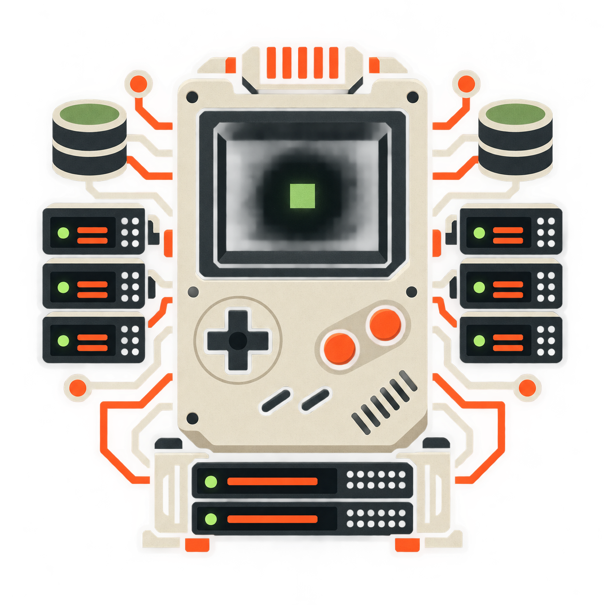

<p align="center">
  
</p>

<h1 align="center">DurableBoy</h1>

<p align="center"><strong>A server-authoritative Game Boy running inside Cloudflare Durable Objects, powered by SameBoy.</strong></p>

<p align="center">
  The browser is the screen and controller. The CPU, memory, cartridge, clock,
  and save state live at the edge.
</p>

No commercial ROMs, Nintendo boot ROMs, or game assets are included. SameBoy's
open-source SameBoot ROM is compiled by the build script. Users must supply ROMs
they are legally entitled to use.

## What is implemented

- One globally addressable `ConsoleDO` per console, running DMG or CGB SameBoy
  behind a small stable C ABI.
- Direct in-memory ROM loading with an 8 MiB limit, plus RGB565 CGB frames and
  packed 2-bit DMG frames over hibernatable WebSockets.
- A single controller lease, spectator connections, and automatic promotion
  when the active controller disconnects.
- Durable frame-level inputs and virtual hardware clocks in SQLite, with compact
  SameBoy checkpoints and battery saves in R2.
- Reconstruction after eviction from the ROM, latest checkpoint, and ordered
  input replay, with SHA-256 integrity and replay verification.
- CPU-adjacent telemetry: chunks, emulated time, observed wall time, Wasm memory,
  and serialized state size. Cloudflare's request traces remain the source of
  truth for billed CPU because Worker clocks do not advance continuously during
  CPU execution.
- SameBoy serial callbacks and cycle-interleaved dual-core execution exposed by
  `db_connect_link` and `db_run_link_frame` for the colocated link-session phase.
- Owner-gated cartridge replacement, eject, and complete console deletion.
- A ROM-first, installable browser console with keyboard, gamepad, pointer, and
  touch controls. Recent consoles and owner capabilities remain in local storage.

The distributed two-Durable-Object link cable, audio, rewind, identity, billing,
and public ROM catalog are intentionally outside this first proof.

## Architecture

```text
Browser canvas + controls
          |
      WebSocket
          |
      ConsoleDO ---------------- SQLite
          |                       machine metadata
     SameBoy.wasm                 checkpoints index
          |                       input events
          +-------------------- R2
                                  ROM bytes
                                  state images
                                  battery saves
```

Wasm memory is a disposable cache. Every chunk commits the virtual clock before
its framebuffer is broadcast. Every 300 frames, and whenever the player pauses
or disconnects, the complete machine is checkpointed. If the Durable Object is
evicted between checkpoints, it restores the last state image and deterministically
replays the durable input log to the committed frame.

## Quick start

Install [Vite+](https://viteplus.dev/), authenticate Wrangler with your
Cloudflare account, and deploy the Worker with the verified SameBoy artifact
from the latest DurableBoy release:

```sh
vp install --frozen-lockfile
vp run wasm:download
vp run check
vp test run
vp exec wrangler r2 bucket create durableboy-data # first deployment only
vp run deploy
```

The deploy command builds the browser client and publishes the Worker, Durable
Object migration, static assets, and R2 binding. Skip the bucket-creation command
when `durableboy-data` already exists.

## Native build

The native build is pinned to SameBoy commit
`213a12ce93d66b105a113debd9396306066a7cfc`, Emscripten 6.0.8, and RGBDS 1.0.3.
It requires GNU Make, Git, and `xxd` in addition to those toolchains.

On macOS, Emscripten and RGBDS are available through Homebrew:

```sh
brew install emscripten rgbds
```

```sh
vp run wasm:build
vp run smoke
vp run wasm:inspect
```

`vp run wasm:build` clones SameBoy at the pinned commit into the ignored
`vendor/SameBoy` directory, builds SameBoot, compiles only the portable core and
`wasm/durableboy.c`, writes `src/emulator/sameboy.wasm`, and prints every Wasm
import/export for review. The generated artifact is intentionally ignored so it
is never mistaken for source or updated without its corresponding license.

Use `vp run dev:client` only for visual frontend work. API calls require the
full `wrangler dev` process.

## Redeploy

Pull the latest source, install the matching verified core, run the checks, and
deploy over the existing Worker:

```sh
vp install --frozen-lockfile
vp run wasm:download
vp run check
vp test run
vp run deploy
```

`wrangler.jsonc` sets a five-minute paid CPU ceiling because profiling emulator
chunks is a core purpose of this PoC. Normal WebSocket commands run one to four
frames and should remain far below it.

## API

| Method   | Route                          | Purpose                                                                                      |
| -------- | ------------------------------ | -------------------------------------------------------------------------------------------- |
| `POST`   | `/api/consoles`                | Create a DMG or CGB console. Returns `{ status, ownerToken }`; the token is shown only once. |
| `GET`    | `/api/consoles/:id`            | Read lifecycle, clock, cartridge, and telemetry.                                             |
| `DELETE` | `/api/consoles/:id`            | Permanently delete SQLite and every R2 object for the console. Owner only.                   |
| `PUT`    | `/api/consoles/:id/cartridge`  | Upload raw `.gb`/`.gbc` bytes and checkpoint frame zero. Owner only.                         |
| `DELETE` | `/api/consoles/:id/cartridge`  | Flush battery RAM and eject the cartridge. Owner only.                                       |
| `GET`    | `/api/consoles/:id/ws`         | Upgrade to the hibernatable control/frame WebSocket.                                         |
| `POST`   | `/api/consoles/:id/pause`      | Pause virtual time and checkpoint.                                                           |
| `POST`   | `/api/consoles/:id/checkpoint` | Force a complete state checkpoint.                                                           |
| `POST`   | `/api/consoles/:id/verify`     | Reconstruct independently and compare state hashes.                                          |

WebSocket client messages are JSON:

```json
{ "type": "input", "buttons": 16 }
{ "type": "advance", "frames": 2 }
{ "type": "checkpoint" }
{ "type": "pause" }
```

Owner-only routes require `Authorization: Bearer <ownerToken>`. Share URLs never
contain that capability.

The owner hash was added before the first public release. Consoles created by an
older private build have no securely recoverable capability and remain read-only;
recreate those consoles rather than weakening ownership checks.

Button bits follow SameBoy's native order: Right, Left, Up, Down, A, B, Select,
Start. Server text messages contain `hello`, `role`, `status`, `checkpointed`, or
`error`. Binary frame
messages begin with `DBF1`, then pixel format, width, height, one reserved byte,
little-endian `uint64` frame and tick counters, and pixel bytes.

## Verification

The repository's regular checks do not substitute a fake emulator for SameBoy:

```sh
vp run check       # generated bindings + lint, format, and strict types
vp test run        # protocol plus Worker/R2/SQLite/WebSocket integration tests
vp run smoke       # build a legal RGBDS ROM and run it through SameBoy Wasm
vp build           # production browser assets
vp run wasm:inspect
```

`wrangler deploy --dry-run` and emulator integration require the generated
`src/emulator/sameboy.wasm`. This is deliberate: a missing native core must fail
the build rather than silently turn the system into a browser emulator or mock.

See [THIRD_PARTY_NOTICES.md](./THIRD_PARTY_NOTICES.md) for SameBoy licensing.
See [docs/architecture.md](./docs/architecture.md) for persistence and authority
boundaries, [SECURITY.md](./SECURITY.md) before deploying publicly, and
[CONTRIBUTING.md](./CONTRIBUTING.md) before opening a pull request.
